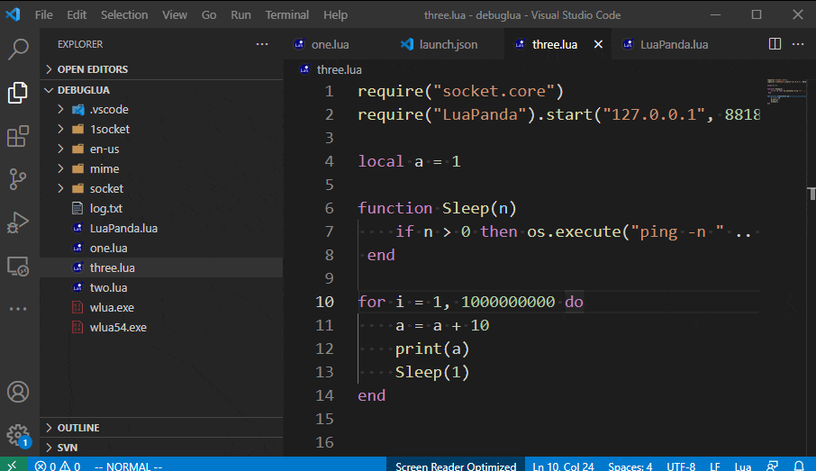

# LuaHelper Guide

## Introduction

Lua is very popular in game development because of its simple syntax and flexible use. However, its ecology is not perfect, and IDE  tools and  support are few, which affects Lua's development efficiency and quality. LuaHelper complies with Microsoft Language Server Protocol and is a cross-platform Lua code editing and testing tool developed in go language.
Compared with other Lua plugins currently on the market, it has the following **improvements**:

- [X] 1. Coroutine development, real-time detection, millisecond output detection results
- [X] 2. Support large-scale Lua projects, perfectly support editing and testing of 1000+ file project 
- [X] 3. Comprehensive error type detection, including: grammar detection, semantic detection 
- [X] 4. Various types of reference search, including: multi-file reference search, multi-layer reference search 
- [X] 5. Rich configurable items, including: multiple alarm information configurations, ignorable file settings 
- [X] 6. Low memory consumption, low-performance machines can still run smoothly

LuaHelper is a High-performance lua plugin, Language Server Protocol for lua.
--------------------------------------------------------------------------------------------------------------------
Lua因其语法简单、使用灵活，在游戏开发中十分流行。但其生态并不完善，IDE开发工具及配套支持较少，一定程度上影响了Lua的开发效率及质量。LuaHelper遵从微软Language Server Protocol协议，是采用go语言开发的一种跨平台Lua代码编辑及检测工具。

相较目前市面其他Lua插件，具有以下**改进**：

- [X] 1.协程开发，实时检测，毫秒级输出检测结果
- [X] 2.支持大型Lua项目，完美支持1000+文件项目工程的编辑与检测
- [X] 3.全面的错误类型检测，包括：语法检测、语义检测
- [X] 4.多种类引用查找，包括：多文件引用查找、多层引用查找
- [X] 5.丰富的可配置项，包括：多种告警信息配置、可忽略文件设定
- [X] 6.内存消耗低，低性能机器仍可流畅运行

## Documentation
[Background [项目背景]](./docs/manual/introduction.md "项目背景介绍") | [Configuration [检查配置]](./docs/manual/config.md "检查配置") | [Manual [源码介绍]](./docs/manual/mainsource.md "源码介绍") | [Annotate [注解功能]](./docs/manual/annotate.md "注解功能")

## Feature Summary

### Code Editing
* [Defintion Find [定义跳转]](./docs/manual/Feature.md/#DefintionFind)
* [Find All References [引用查找]](./docs/manual/Feature.md/#FindAllReferences)
* [Document Symbols [文件符号表查询]](./docs/manual/Feature.md/#DocumentSymbols)
* [Workspace Symbols [工程符号表查询]](./docs/manual/Feature.md/#WorkspaceSymbols)
* [Auto Code Completion [自动代码补全]](./docs/manual/Feature.md/#AutoCodeCompletion)
* [Format Code [代码格式化]](./docs/manual/Feature.md/#FormatCode)
* [Hover [代码悬停]](./docs/manual/Feature.md#Hover)
* [Hightlight Global Var [全局变量着色]](./docs/manual/Feature.md/#HightlightGlobalVar)

### Code Detection
* [Syntax Check [语法检测]](./docs/manual/Feature.md/#SyntaxCheck)
* [Semantic Check [语义检测]](./docs/manual/Feature.md/#SemanticCheck)
* [Quick Analysis [快速增量分析]](./docs/manual/Feature.md/#QuickAnalysis)

### Debug lua
调试功能集成了腾讯开源[LuaPanda](https://github.com/Tencent/LuaPanda)的调试组件，采用了[Debug Adapter Protocol](https://microsoft.github.io/debug-adapter-protocol/)调试协议。debugger主体使用lua语言开发，调试程序只要引入LuaPanda.lua文件，即可方便开启调试功能。
* [Debug Principle [调试原理]](./docs/manual/debugPrinciple.md)
* [Debug Use [接入调试方法]](./docs/manual/usedebug.md)
* [Debug and Run Sigle Lua File [单文件调试与运行]](./docs/manual/debugsinglefile.md)

## Installation
**App Market Installation**
* Click the Vs Code application market icon 
* Search luahelper in the input box 
* Click to install Lua Helper
* Marketplace url: https://marketplace.visualstudio.com/items?itemName=yinfei.luahelper

**应用市场安装**
* 点击Vs Code应用市场图标
* 在输入框中搜索 luahelper
* 点击安装Lua Helper
* 应用市场链接: https://marketplace.visualstudio.com/items?itemName=yinfei.luahelper

## Acknowledgements
* [luago-books](https://github.com/zxh0/luago-book), go语言生成lua的AST，修改了源码（对AST的每个节点增加了列的属性，同时也优化了性能）。
* [LuaFormatter](https://github.com/Koihik/LuaFormatter), c++写的Lua代码格式化库，性能较高。
* [LuaPanda](https://github.com/Tencent/LuaPanda), 集成了LuaPanda的调试组件，LuaPanda的作者stuartwang也给我们提供了很多帮助。
* [EmmyLua](https://github.com/EmmyLua), 作者阿唐对我们整个插件的实现提供很多帮助和建议。

## Support
If you have any questions, please refer to [FAQ](#FAQ). If you have any questions, please use [issues](https://github.com/yinfei8/LuaHelper/issues). We will follow and reply.
如有问题先参阅 [FAQ](#FAQ) ，如有问题建议使用 [issues](https://github.com/yinfei8/LuaHelper/issues) ，我们会关注和回复。

Email：yvanfyin@tencent.com; handsomeli@tencent.com; richardzha@tencent.com

QQ群：747590892

