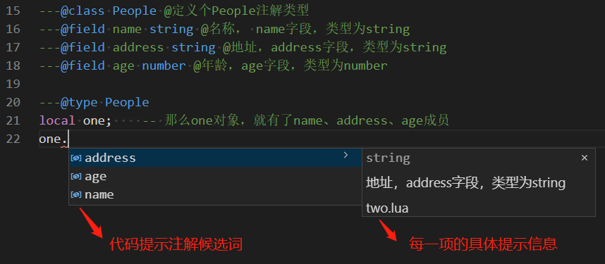
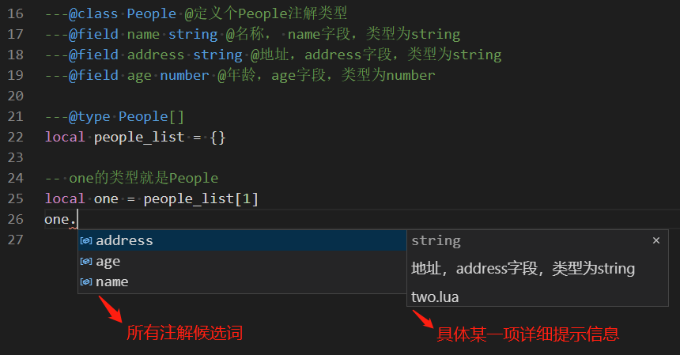
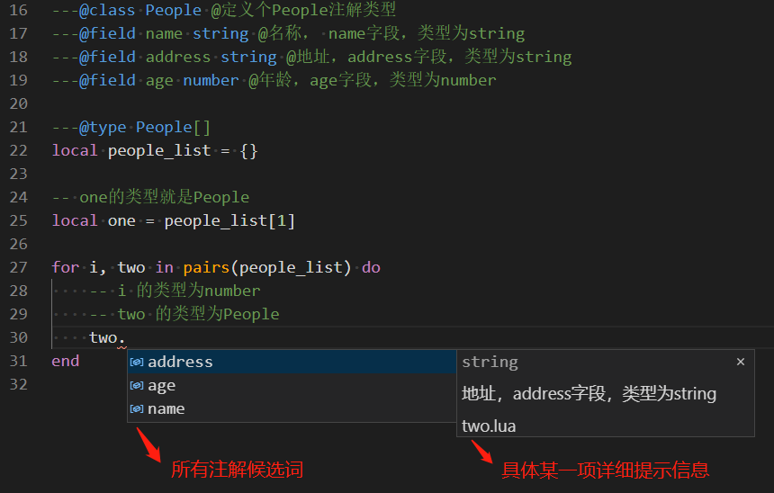
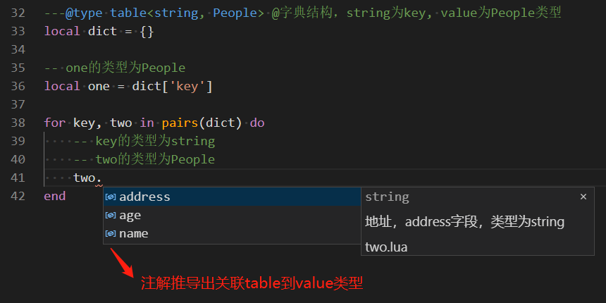
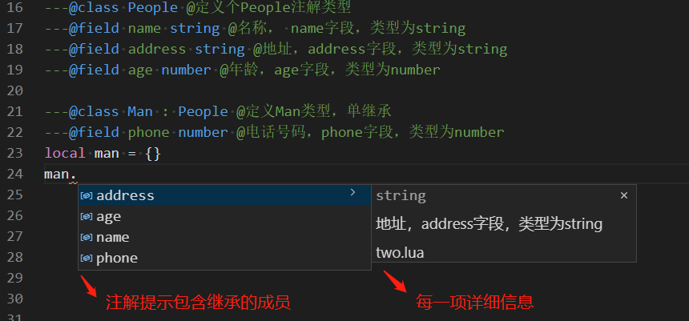
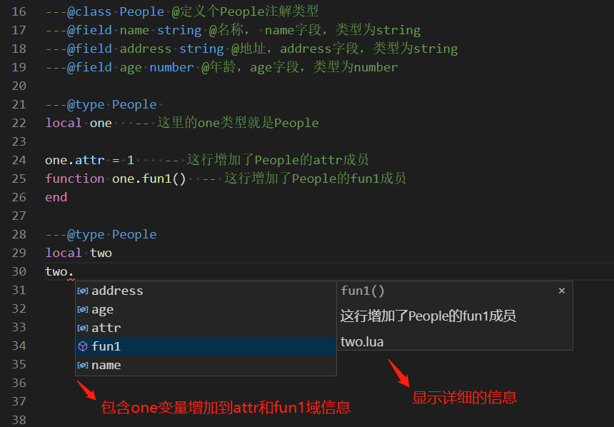
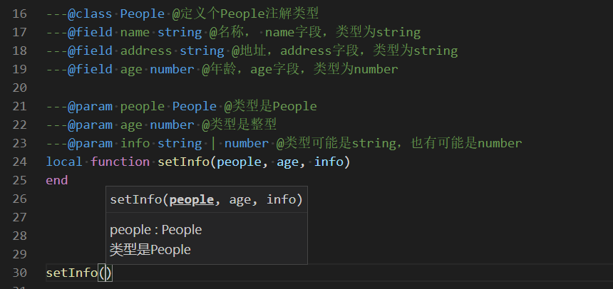
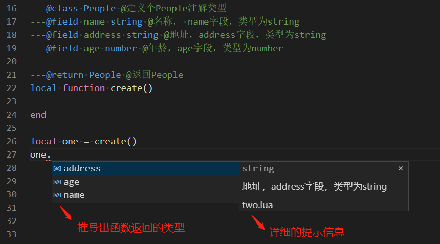
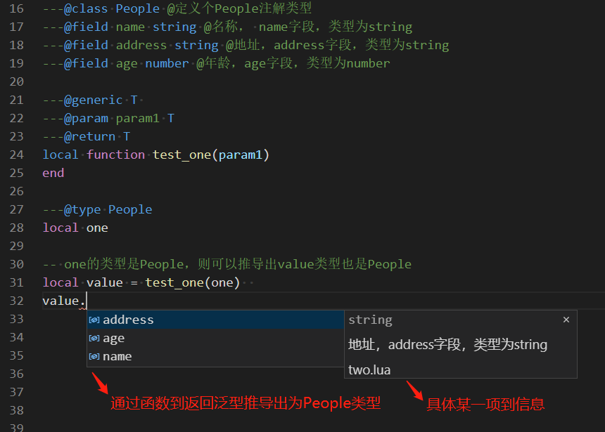

[TOC]
# 注解功能

## 0 参考
注解功能参考了emmylua的定义，并扩展了它的功能</br>
emmylua注解中文版本：https://emmylua.github.io/zh_CN/annotation.html
emmylua注解英文版本: https://emmylua.github.io/annotation.html

## 1 作用
希望通过注释的方式表明一个结构有哪些成员，类似于C++ 定义一个struct，表明有哪些成员，其他地方再申明这个struct的变量，那么申明的变量就关联了这个struct类型。

例如下面的C++ 代码：
```C++
// 先定义一个struct
struct People{
  string name;
  string address;
  int age;
};

// 申明一个People对象
PeoPle one; // 那么one对象，就有了name、address、age成员
```

Lua没有显示的申明类型系统，我们只能通过注释方式来模拟类型系统。注释的方式是非侵入式的，不会修改lua代码及其解释器。

Lua通过注解模拟上面的例子为：
```lua
---@class People @定义个People注解类型
---@field name string @名称， name字段，类型为string
---@field address string @地址，address字段，类型为string
---@field age number @年龄，age字段，类型为number

---@type People
local one;    -- 那么one对象，就有了name、address、age成员
```
样例如下：



**上面的：**
* ---@class表示申明一个table
* ---@field表示这个talbe有哪些子成员
* ---@type表示变量关联成什么类型

注：lua的注解为区分普通的注释，都是---@开头

## 2 整体语法

- 1） 表明变量的类型 

    **---@type TYPE{|OTHER_TYPE} [@comment]**

- 2）定义一个类型，类似C++里面struct结构
  
    **---@class TYPE[: PARENT_TYPE {, PARENT_TYPE}] [@comment]**

- 3）定义上面class的成员 
  
    **---@field [public|protected|private] field_name TYPE{|OTHER_TYPE} [@comment]**

- 4）定义函数参数的类型
  
    **---@param param_name TYPE{| OTHER_TYPE} [@comment]**

- 5）定义函数返回值的类型

    **---@return TYPE{| OTHER_TYPE} [@comment]**

- 6）定义类型的别名
  
  **---@alias new_type TYPE{ | OTHER_TYPE}**

- 7）定义泛型类型，运用在函数中
  
  **---@generic G1 [: PARENT_TYPE] [, G2 [: PARENT_TYPE]]**

## 3 具体用法
### 3.1 type类型
    使用type指明一个变量的类型

- 完整格式：

    **---@type TYPE{|OTHER_TYPE} [@comment]**

其中：
* TYPE或OTHER_TYPE表示lua默认的类型，或是自己定义的其他类型
* @comment 表示额外的说明，说明的内容是comment

注：
* {} 表示存在0个或多个内容
* [] 表示存在0个或1个内容

**Lua的默认类型有:** 
* nil         空
* boolean：   表示bool型，取值true或false
* number：    整型或浮点型
* string:     字符串类型
* function：  函数 
* userdata：  其他宿主语言存储出数据 
* thread：    Lua定义的协程
* any：       表示什么类型都可以
* table：     默认的table类型
* void：      空的类型，例如函数什么都不返回
    

**详细使用例子如下：**
1. 定义局部变量</br>
```lua
---@class People
---@field name string
---@field address string
---@field age number

---@type People @instance of People
local one = {}
```

* 因为Lua是动态的类型，你一个变量可能有不同的类型，使用| 表示或有多个类型。
   
```lua
---@type People | number @可能是People类型，也有可能是默认的number类型
local one
```

2. 定义全局变量</br>
```lua
---@type People @global variable type
global_people = {}
```

3. 定义table子成员类型
```lua
local team = {}
---@type People @子成员的属性是People
team.one = getPeople()
```

**一行代码中可能定义多个变量，多个变量的类型都进行申明，有两种方式：**</br>
* 1）使用，分割申明多个类型
```lua
---@type string, number @one是string类型 @two是number类型
local one, two
```

* 2）使用多行的方式声明，这种方式推荐
```lua
---@type string @one是string类型
---@type number @two是number类型
local one, two
```

### 3.2 数组类型
    利用TYPE[] 的方式来标注一个数据类型为数组

- 完整格式：

    **---@type TYPE[] [@comment]**

- 示例：

```lua
---@class People
---@field name string
---@field address string
---@field age number

---@type People[]
local people_list = {}

-- one的类型就是People
local one = people_list[1]

for i, two in pairs(people_list) do
    -- i 的类型为number
    -- two 的类型为People
end
```

- 演示





### 3.3 字典类型
    利用table的方式来标注一个类型为字典

- 完整格式：

    **---@type table<VALUE_TYPE, VALUE_TYPE> [@comment]**

- 示例：
```lua
---@type table<string, People> @定义的People的字典结构，string为key, value为People类型
local dict = {}

-- one的类型为People
local one = dict['key']

for key, two in pairs(dict) do
    -- key的类型为string
    -- two的类型为People
end
```

- 演示




- 特殊用法

    可以省略知名table的key和value</br>
    **---@type table [@comment]**

### 3.4 定义fun函数类型
    使用@fun来标注一个数据类型为函数

- 完整格式:

    **---@type fun(param1: PARAM_TYPE1, param2: PARAM_TYPE2) {:RETURN_TYPE1, RETURN_TYPE2} @comment**

- 示例：
  
    1 ) 简单的例子
    ```lua
    ---@type fun() @为函数简单函数类型，这个函数没有参数，没有返回值
    local fun1
    ```

    2 ）带一个函数参数的例子
    ```lua
    ---@type fun(param1 : string) @ 函数只有一个参数，没有返回值
    local fun2
    ```

    3 ） 带多个函数参数的例子
    ```lua
    ---@type fun(param1 : string | number, param2 : number) @函数参数有两个，第一个参数类型为string或number，第二个参数类型为number，函数没有返回值
    local fun3
    ```

    4 ) 带函数一个返回值的例子
    ```lua
    ---@type fun(param1 : string, param2 : number) : number @函数参数有两个，第一个参数类型为string，第二个参数类型为number；函数只有一个返回值，类型为number
    local fun4
    ```

    5 ) 带函数多个返回值的例子
    ```lua
    ---@type fun(param1 : string, param2 : number) : number, string | number @函数参数有两个，第一个参数类型为string，第二个参数类型为number；函数只有2个返回值，第一个类型为number，第二个返回值类型为string或number
    local fun5
    ```

### 3.5 class定义类型
    使用@class模拟C++里面的struct，同时也支持继承，包括多继承.

- 详细的格式如下：

    **---@class TYPE[: PARENT_TYPE {, PARENT_TYPE}] [@comment]**

- 示例, 下面有三种用法说明：
  
    1） 不含有继承关系
    ```lua
    ---@class People @定义People类型
    ---@field name string
    ---@field address string
    ---@field age number
    ```
    2）含有单继承关系
    ```lua
    ---@class Man : People @定义Man类型，单继承
    ---@field phone number
    ```
    

    3） 包含多继承关系
    ```lua
    ---@class Man : People, Team @定义Man类型，多继承
    ---@field attr string @额外属性
    ```

- 特殊用法
  
    1）class注解域后面，紧跟定义的变量，则变量的类型为class的类型，可以省略@type的定义
    ```lua
    ---@class People @定义People类型
    ---@field name string
    ---@field address string
    ---@field age number
    local one   -- 这里的one类型就是People；前面一行可以省略---@type People
    ```

    2）class注解定义的类型，同文件定义的变量会扩充class的成员field信息。
    ```lua
    ---@class People @定义People类型
    ---@field name string
    ---@field address string
    ---@field age number

    ---@type People 
    local one   -- 这里的one类型就是People
    
    one.attr = 1    -- 这行增加了People的attr成员
    function one.fun1()  -- 这行增加了People的fun1成员
    end

    ---@type People
    local two
    ```
    

### 3.6 field定义class的成员
    使用@field增加前面定义的class成员
- 完整格式如下：
**---@field [public|protected|private] field_name TYPE{|OTHER_TYPE} [@comment]**

- 示例，使用field时候，需要紧挨着@class的申明，例如下面:
  
    ```lua
    ---@class People @定义People结构
    ---@filed public name string @紧挨着上一行的class，表明有name成员
    local one = {} --定义的这行紧跟着class的定义，表明类型就是People，那么one就有name成员
    ```

### 3.7 param参数的申明
    使用@param可以方便定义参数的类型

- 完整格式如下：
**---@param param_name TYPE{| OTHER_TYPE} [@comment]**

- 示例
  
  1） 函数参数的例子
  ```lua
  ---@param people People @类型是People
  ---@param age number @类型是整型
  ---@param info string | number @类型可能是string，也有可能是number
  local function setInfo(people, age, info)
  end
  ```
    

  2）匿名函数的例子
  ```lua
  ---@param info string | number @类型可能是string，也有可能是number
  setCallback(function(info)
      
  end)
  ```

  3）循环的例子
  ```lua
  ---@param k number @类型为整型
  ---@param info People @类型指向People
  for k, info in pairs(info_table) do
  end
  ```

### 3.8 对函数注解
#### 3.8.1 注解函数的参数类型

    使用@param可以定义函数参数的类型

- 完整格式如下：<br>
**---@param param_name TYPE{| OTHER_TYPE} [@comment]**

    1） 如3.7函数参数的例子
  ```lua
  ---@param people People @类型是People
  ---@param age number @类型是整型
  ---@param info string @类型可能是string
  local function setInfo(people, age, info)
  end
  ```

   

#### 3.8.2 注解函数的返回值类型
    使用@return表示函数的返回类型

  - 完整的格式如下:
  
    **1) 一行返回单个返回值**<br>
    **---@return TYPE{| OTHER_TYPE} [@comment]**

    **2) 多个返回值，每一行表示一个返回值**<br>
    **---@return TYPE{| OTHER_TYPE} [@comment]**
    **---@return TYPE{| OTHER_TYPE} [@comment]**

    **3）一行返回多个返回值**</br>
    **---@return TYPE{| OTHER_TYPE}, TYPE{| OTHER_TYPE}  [@comment1]  [@comment2]**

- 示例

    1）函数返回简单例子
    ```lua
    ---@return People @返回People
    local function create()
        
    end
    ```
    


    2）函数返回多个返回值复杂例子
    ```lua
    ---@return number @第一个返回值为number类型
    ---@return People @第二个返回值是返回People
    local function getInfo()
        
    end
    ```

    3）函数多个返回值可以写在同一行
    ```lua
    ---@return number, string @第一个返回值是number @第二个返回值是名称string类型
    ---@return People @第三个返回值是返回Car或是Ship
    local function getInfo()
        
    end
    ```

#### 3.8.3 函数注解的详细例子

```lua
    --- 获取玩家的信息
    ---@param name string @参数1表示用户的名称
    ---@param age number @参数2表示用户的年龄
    ---@return boolean @第一个表示玩家玩家信息是否成功，true表示成功
    ---@return People @第2个返回值获取具体的玩家信息
    local function getInfo(name, age)
        
    end
```

    上面的例子中，表明getInfo函数，需要传人两个参数，函数的返回值也是两个。第1个返回获取玩家信息是否成功，第2参数表示获取的具体的玩家信息。

### 3.9 alias别名类型
    使用@alias将其他的类型关联成一个新的别名，类似于C++ 语言的typedef。主要方便一些复杂的类型关联成一个简单的新类型。

- 完整格式如下：

    **---@alias new_type TYPE{ | OTHER_TYPE}**

- 示例
  
    1）简单例子
    ```lua
    ---@alias NewOne string | number @NewOne表示是string或者是number

    ---@type NewOne @对应的为string或者是number
    local one
    ```

    2）复杂例子
    ```lua
    ---@alias Handler fun(one: string, two : number) : void @Handler关联成一个函数的定义

    ---@param handler Handler
    function addHandler(handler)
    end
    ```

### 3.10 generic 泛型类型
    利用@generic来模拟高级语言中的泛型，类似于C++ 语言中的模板，例如下面的C++ 例子：

```C++
    // T是一个类型，函数的两个参数都是这个类型，函数的返回对应的这个类型
    template <typename T>
    T const& Max (T const& a, T const& b) 
    { 
        return a < b ? b:a; 
    } 
```

- 完整格式如下：
  
    **---@generic G1 [: PARENT_TYPE] [, G2 [: PARENT_TYPE]]**

- 示例

    1 ) 简单例子
    ```lua
    ---@generic T 
    ---@param param1 T
    ---@return T
    local function test_one(param1)
    end


    ---@type People
    local one

    local value = test_one(one)  -- one的类型是People，那么test_one函数返回类型也是People，则可以推导出value类型也是People

    ```
    


    2 ) 复杂例子
    ```lua
    ---@generic T : Transport, K
    ---@param param1 T
    ---@param param2 K
    ---@return T
    local function test_two(param1, param2)
        -- todo
    end

    ```

## 4 完整例子

```lua
    -- 1）演示type定义新类型的用法
    ---@class People @定义People类型
    ---@field name string @名称，类型为字符串
    ---@field address string @地址，类型为字符串
    ---@field age number @年龄，类型为整型
    
    ---@type People
    local one           -- 这里定义一个变量为People类型。那么后面当输入 one. 时候，会提示People的所有成员
    print(one.address)

    -- 2）演示函数的用法
    -- 下面这个函数定义了name参数的类型，以及函数的返回值一个People类型
    ---@param name string @这个参数为人名
    ---@return People @这个函数返回了一个People
    function create_people(name)
    end

    -- 调用上面的函数，会返回People类型；那么two变量的类型会推导为People类型
    local two = create_people("yinfei")

    -- 下面当输入 two. 时候，会提示People的所有成员
    print(two.age)

    -- 3）演示变量追踪功能
    -- 这里是演示变量跟踪功能，由于two的类型是People，这里赋值给three，那么three的类型也为People
    local three = two

    -- 下面当输入 three. 时候，会提示People的所有成员
    print(three.age)

    -- 4）演示注解与相lua 结合标注类型功能
    ---@class Car @定义Car类型
    ---@field name string
    ---@field color string

    ---@type Car 
    local car   -- 这里的car类型就是People

    car.age = 1    -- 这行增加了car的attr成员；由于上面定义car的变量与Car注解类型在同一个文件，此时这个语句，也扩充了Car的成员：age
    function car.run()  -- 这行增加了car的fun1成员；由于上面定义car的变量与Car注解类型在同一个文件，此时这个语句，也扩充了Car的成员：run
    end

    -- 因此Car的类型有4个成员：name、color、attr、run
    ---@type Car
    local car1
    -- 下面当输入 car1. 时候，会补全出Car的所有成员：name、color、attr、run
    print(car1.age)

    -- 5）演示继承的用法
    ---@class Man : People @定义Man类型，它继承了People类型
    ---@field height number @man类型额外定义了height 类型
    local four      -- 由于four，上面紧跟踪class注解，上面可以省略直接标注four的类型。此时four的类型，为Man类型

    -- 当输入 four. 的时候，会提示People类型的成员，同时也会提示height成员
    print(four.height)

    -- 6）演示泛型的用法
    -- test_one函数的返回类型，等于param1的参数类型
    ---@generic T 
    ---@param param1 T
    ---@return T
    local function test_one(param1)
    end

    ---@type People
    local one

    local value = test_one(one)  -- one的类型是People，那么test_one函数返回类型也是People，则可以推导出value类型也是People
    -- 下面输入 value. 的时候，也会提示People所有的成员。
    print(value.age)

```